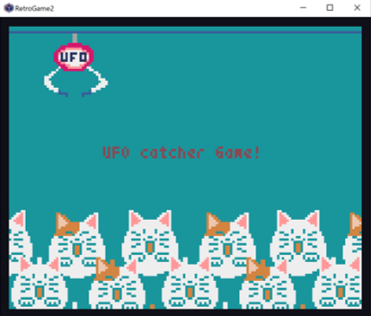
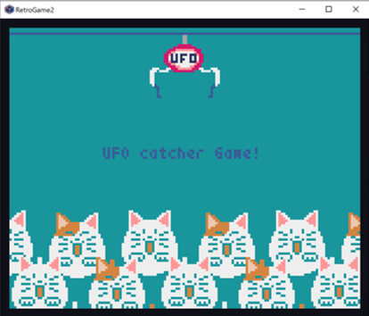

# UFOcatchergame

python向けのレトロゲームエンジンであるPyxelを使用して
ゲームセンターにありそうなUFOキャッチャーの画面を作ってみました。

クレーン部分はpyxeleditorで作りました。
アーム開(32×32)のクレーンとアーム閉(32×32)のクレーンを作り、
交互に表示されるようにしました。またこのアームは左から右に移動するようにしました。

また、こちらは本物のUFOキャッチャーのような商品を持ち上げる等のギミックは搭載していません。
クレーンの動きとUFOキャッチャーの世界を楽しんでください！

